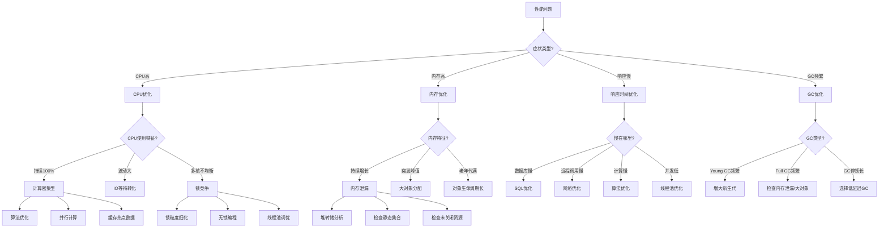
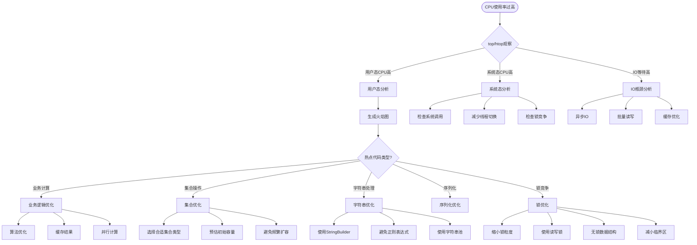
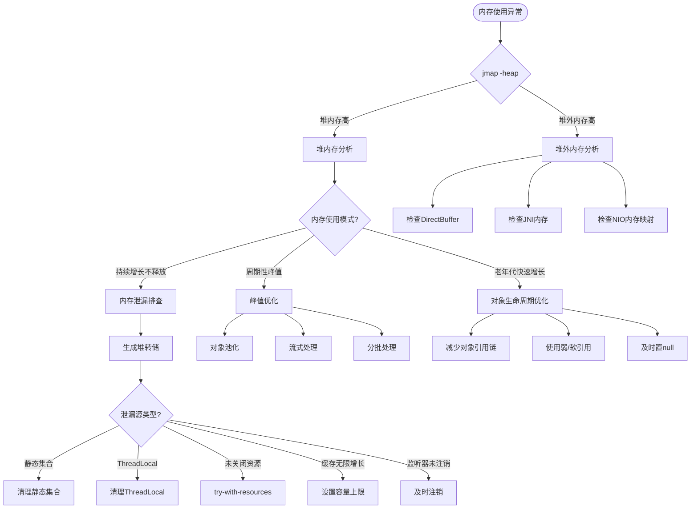
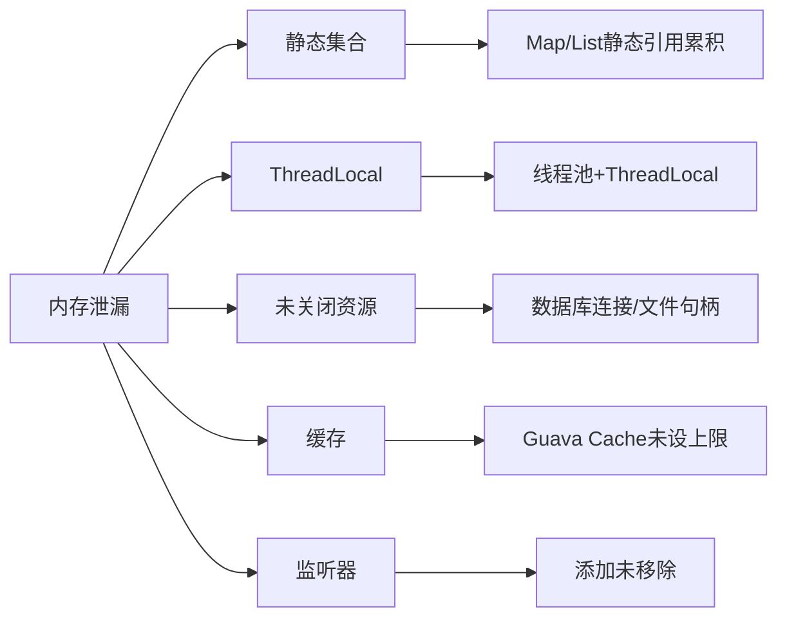
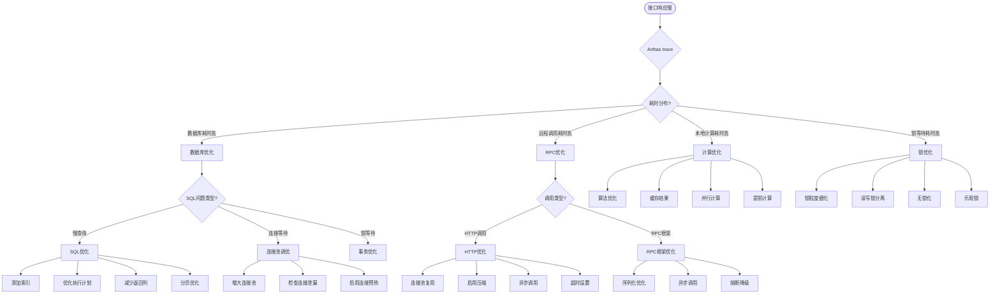
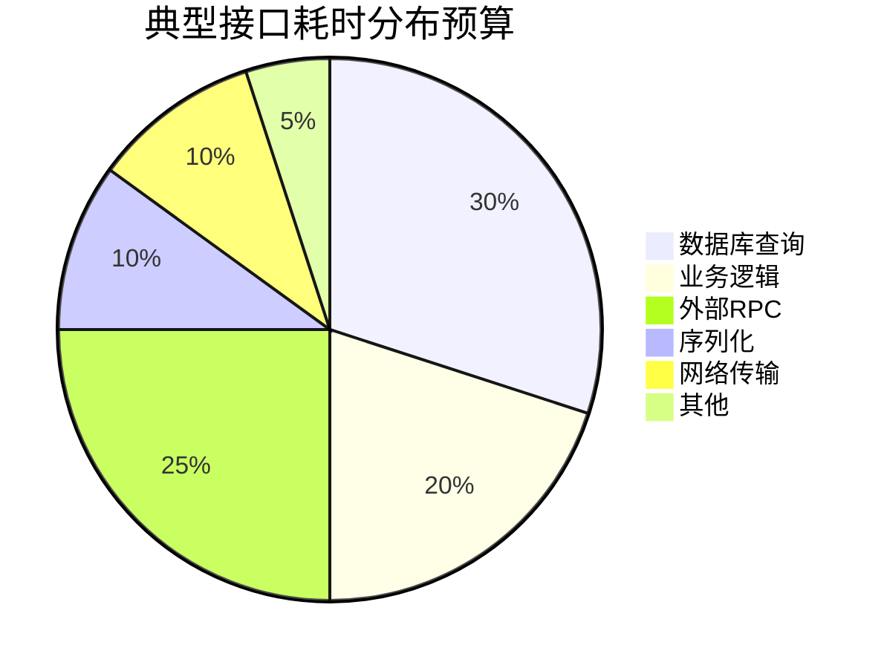
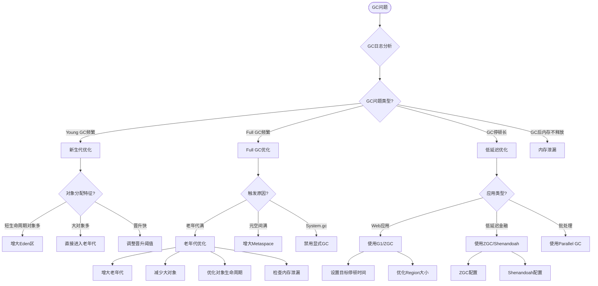
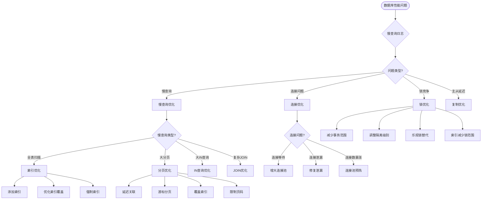
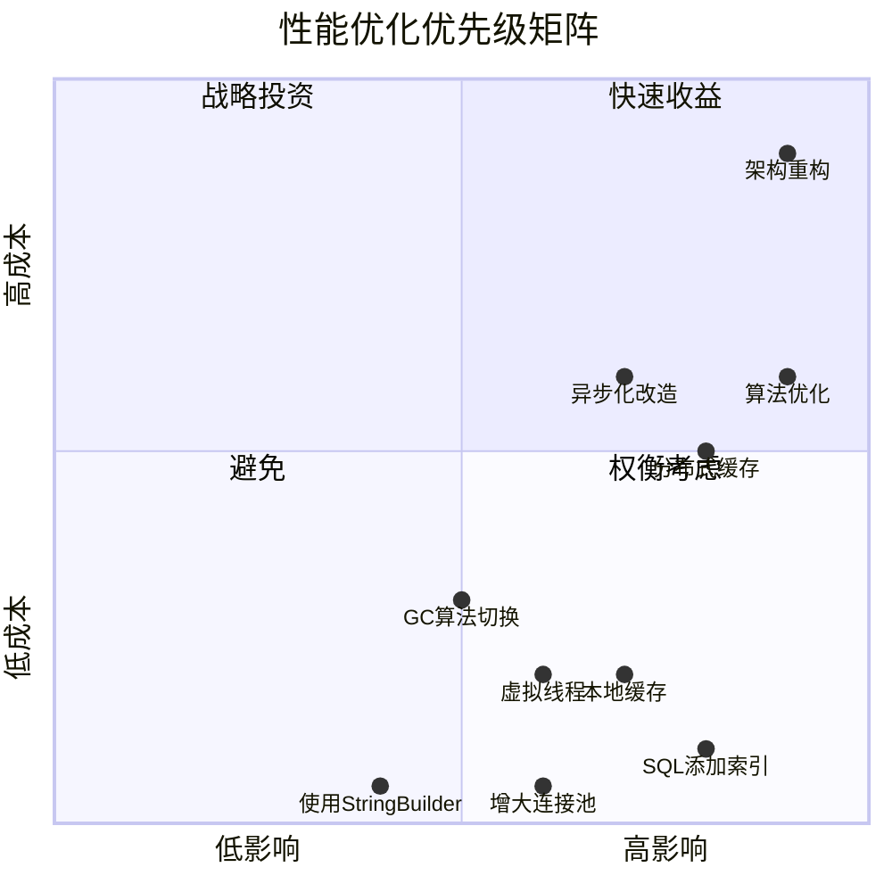

# 性能优化决策树

> 按症状快速定位性能问题根因，获取优化方案

---

## 🚀 快速导航

| 症状 | 跳转到 |
|------|--------|
| CPU 使用率过高 | [CPU 优化决策树](#cpu-优化决策树) |
| 内存使用过高 / OOM | [内存优化决策树](#内存优化决策树) |
| 接口响应慢 | [响应时间优化决策树](#响应时间优化决策树) |
| GC 频繁 / 停顿长 | [GC 优化决策树](#gc-优化决策树) |
| 数据库慢 | [数据库优化决策树](#数据库优化决策树) |

---

## 📊 全景决策树（Mermaid 图表）



---

## 🖥️ CPU 优化决策树

### 决策流程



### 快速检查清单

| 检查项 | 命令/工具 | 正常值 | 异常处理 |
|--------|----------|--------|----------|
| CPU使用率 | `top` | < 70% | 分析火焰图 |
| 上下文切换 | `vmstat 1` | < 10万/秒 | 检查锁竞争 |
| 线程CPU分布 | `ps -mp <pid> -o THREAD,tid,time` | 均衡 | 检查线程亲和性 |

---

## 💾 内存优化决策树

### 决策流程



### 内存泄漏常见模式



---

## ⏱️ 响应时间优化决策树

### 决策流程



### 响应时间分层预算



---

## 🗑️ GC 优化决策树

### 决策流程



### GC 选择决策表

| 应用场景 | 推荐GC | 目标停顿 | 配置示例 |
|---------|--------|---------|---------|
| 低延迟 (< 10ms) | ZGC | < 1ms | `-XX:+UseZGC -XX:ZCollectionInterval=5` |
| 低延迟 (< 100ms) | G1 | < 200ms | `-XX:+UseG1GC -XX:MaxGCPauseMillis=200` |
| 高吞吐 | Parallel | 不敏感 | `-XX:+UseParallelGC` |
| 小内存 (< 100MB) | Serial | < 1s | `-XX:+UseSerialGC` |

---

## 🗄️ 数据库优化决策树

### 决策流程



---

## 🔧 使用命令行决策树工具

```bash
# 运行交互式决策树
./scripts/perf-decision-tree.sh

# 输出示例：
# ========================================
#   Java 性能优化决策树
# ========================================
# 
# 请选择当前症状：
# 1) CPU 使用率过高
# 2) 内存使用过高 / OOM
# 3) 接口响应慢
# 4) GC 频繁 / 停顿长
# 5) 数据库慢
# 
# 请输入选项 [1-5]: 1
# 
# → 检查 CPU 使用特征：
# 1) 持续100%（计算密集型）
# 2) 波动大（IO转化）
# 3) 多核不均衡（锁竞争）
# ...
```

---

## 📱 使用 Web 决策树

打开 `docs/decision-tree.html` 文件，可以通过点击进行交互式导航：

```bash
# 本地启动简单 HTTP 服务器查看
python3 -m http.server 8000
# 然后访问 http://localhost:8000/docs/decision-tree.html
```

---

## 📝 决策速查表

### 症状 → 工具 → 方案 映射

| 症状 | 诊断工具 | 关键指标 | 常用方案 |
|------|---------|---------|---------|
| CPU高 | async-profiler | 热点方法 | 缓存、算法优化 |
| 内存高 | jmap + MAT | 大对象、泄漏源 | 对象池、弱引用 |
| 响应慢 | Arthas trace | 耗时分布 | 异步、缓存、索引 |
| GC频繁 | GC日志 + gceasy | GC频率、停顿 | 调堆大小、换GC |
| 线程高 | jstack | BLOCKED状态 | 锁优化、无锁化 |

---

## 🎯 优化优先级矩阵



---

**相关文档**
- [00-性能优化SOP流程.md](00-性能优化SOP流程.md)
- [01-代码层面优化.md](01-代码层面优化.md)
- [02-JVM调优指南.md](02-JVM调优指南.md)
- [03-数据库优化指南.md](03-数据库优化指南.md)
- [04-并发优化指南.md](04-并发优化指南.md)
- [05-缓存策略指南.md](05-缓存策略指南.md)
